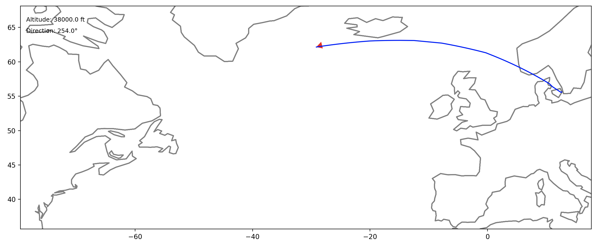

# Flight Animation Repository

This repository contains code for visualizing flight paths with animated markers on a Matplotlib plot, superimposed on geographical coastlines. It uses data from CSV files to create comprehensive visual representations of flights, updating in real-time to simulate movement.

## Preview


This animation depicts the flight path for HV5685 from Amsterdam Schiphol, to Lanzarote, visualized in the flight animation software. The gif provides a snapshot of the dynamic path plotting and coastline integration, along with the plane's current altitude and direction.

## 3D Preview


3D animation of flight KL1953 from Amsterdam Schipol to Athens


## Installation

Before running the scripts, ensure you have Python installed on your system. The project depends on several Python libraries, including Matplotlib, Numpy, and Pandas. You can install all required dependencies with pip:

```bash
pip install matplotlib numpy pandas
```

## Repository Structure

- `flight_plot.py`: Module containing functions and classes for loading flight data, handling data, and plotting.
- `animate_flight.py`: Script for running the animation of the flight path.
- `data/`: Directory containing sample flight data and coastline data in CSV and JSON formats, respectively.

## Usage

To run the flight path animation, execute the `animate_flight.py` script. Ensure that you have the appropriate CSV file in your `data/` directory. Here’s a brief rundown of how to use the script:

1. **Set the flight data file path**: Modify the `path` variable in `animate_flight.py` to point to your flight data CSV file.
2. **Run the script**: Execute the script to see the flight path animation. 

```python
python animate_flight.py
```

This will open a Matplotlib window displaying the animated flight path over the static geographical map.

## Functionality

The script provides the following functionality:

- **FlightInfo Class**: Manages flight data, including position, speed, altitude, and direction.
- **Animation**: Visualizes the flight path using an animated marker that moves according to the flight's recorded data points.
- **Geographical Context**: Plots coastlines to provide geographical context for the flight path.


Another example snapshot of a SK909 flight from Copenhagen (CPH) to New York (JFK)


## Contributing

Contributions to this repository are welcome. Here are some ways you can contribute:

- **Reporting bugs**
- **Suggesting enhancements**
- **Writing or improving documentation**

For substantial changes, please open an issue first to discuss what you would like to change. Ensure to update tests as appropriate.

## License

This project is open-source and available under the [MIT License](LICENSE).
